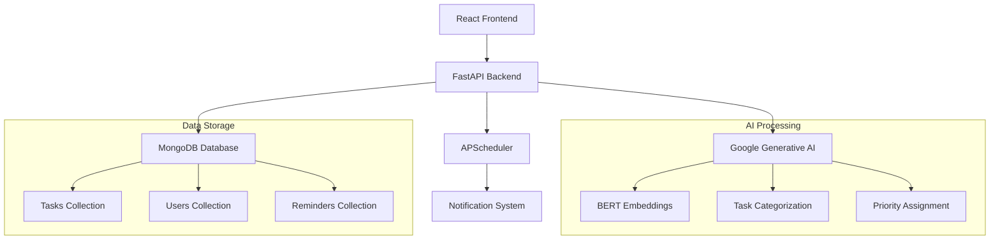

# TaskFlow AI — Intelligent Productivity Assistant

AI-Powered Smart Productivity and Task Automation Assistant

[](https://www.python.org/)
[](https://reactjs.org/)
[](LICENSE)
[]()
[]()
[]()

🔧 Add screenshot here: `/screenshots/dashboard.png`

<!-- Preview thumbnails -->
<p align="center">
  
  
  
</p>

## Description

TaskFlow AI is an advanced productivity assistant that leverages artificial intelligence to revolutionize task management. This intelligent system automatically categorizes tasks, prioritizes them based on urgency and personal patterns, schedules them optimally, and generates actionable insights to boost your productivity.

Built using **FastAPI + React + Tailwind + MongoDB + Google Generative AI**, TaskFlow AI features a fully responsive interface with a stunning HyperLux theme that provides an immersive user experience across all devices.

## Table of Contents

- [Features](#features)
- [Tech Stack](#tech-stack)
- [Installation](#installation)
- [Environment Variables](#environment-variables)
- [Running Backend](#running-backend)
- [Running Frontend](#running-frontend)
- [Architecture Overview](#architecture-overview)
- [Screenshots](#screenshots)
- [Roadmap](#roadmap)
- [Contributing](#contributing)
- [License](#license)

## Features

✔ Add / Edit / Delete Tasks  
✔ AI Auto Categorization  
✔ AI Priority Suggestion  
✔ Auto Scheduling  
✔ Smart Reminders  
✔ Insights Analytics Dashboard  
✔ Drag-and-Drop Workflow Board  
✔ Dark / Light Theme Toggle  
✔ Offline Support (IndexedDB)  
✔ Voice Input for Task Creation  
✔ Semantic AI Search  
✔ AI Weekly Summary  
✔ Pomodoro Focus Mode  
✔ Holo-Glass UI and Animations  

## Tech Stack

| Layer | Technology |
|------|------------|
| Frontend | React (Vite), TailwindCSS, Framer Motion, HeadlessUI |
| Backend | FastAPI, Python |
| Database | MongoDB Atlas |
| AI | Google Generative AI (Gemini), Sentence Transformers |
| Authentication | JWT (optional) |
| Notifications | Push API + SendGrid |
| Deployment | Vercel / Render / Railway |

## Installation

```bash
git clone https://github.com/USERNAME/TaskFlow-AI.git
cd TaskFlow-AI
```

### Backend Setup

```bash
cd backend
python -m venv .venv
source .venv/bin/activate # windows: venv\Scripts\activate
pip install -r requirements.txt
cp .env.example .env
```

Fill `.env` with:

```env
GOOGLE_API_KEY=your_google_api_key_here
MONGO_URI=mongodb://localhost:27017/
JWT_SECRET_KEY=your_jwt_secret_key_here
```

### Start Backend

```bash
uvicorn main:app --reload
```

### Frontend Setup

```bash
cd frontend
npm install
cp .env.example .env
```

Add in `.env`:

```env
VITE_API_URL=http://localhost:8000
```

### Start Frontend

```bash
npm run dev
```

## Architecture Overview



## Screenshots

*(Add screenshots of your application here)*

- Dashboard View: `/screenshots/dashboard.png`
- Workflow Board: `/screenshots/workflow.png`
- AI Assistant: `/screenshots/assistant.png`

## Roadmap

- [ ] Multi-device sync
- [ ] Calendar sync with Google OAuth
- [ ] Team Collaboration mode
- [ ] Mobile app version

## Contributing

1. Fork the repository
2. Create your feature branch (`git checkout -b feature/AmazingFeature`)
3. Commit your changes (`git commit -m 'Add some AmazingFeature'`)
4. Push to the branch (`git push origin feature/AmazingFeature`)
5. Open a pull request

### Code Style Rules

- Follow PEP 8 for Python code
- Use ESLint and Prettier for JavaScript/JSX
- Write meaningful commit messages
- Include tests for new functionality

### Branch Naming Rules

- `feature/feature-name` for new features
- `bugfix/issue-name` for bug fixes
- `hotfix/hotfix-name` for critical hotfixes
- `release/version-number` for releases

## License

This project is licensed under the MIT License - see the [LICENSE](LICENSE) file for details.

---

<p align="center">Made with ❤️ by the TaskFlow AI Team</p>